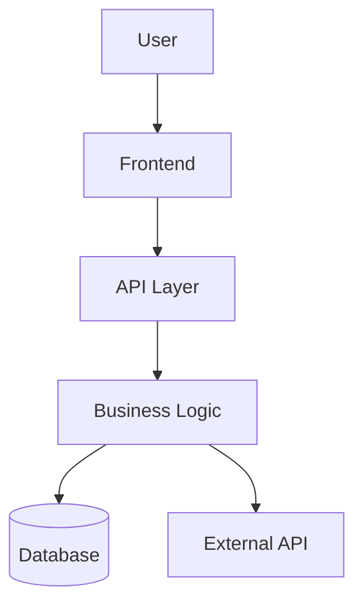
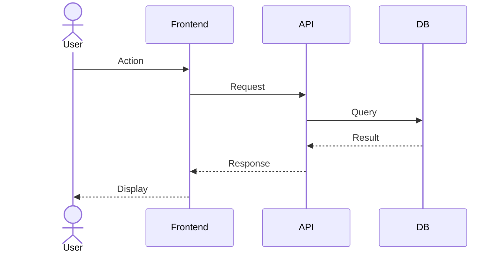

# DOCUMENT Stage Adapter

This reference defines the complete DOCUMENT Stage workflow -- Stage 7 of the dev-lifecycle pipeline. When Claude reads this file, it follows the instructions below to generate architecture diagrams, sequence diagrams, and update project documentation.

## When This Runs

- User says "document", "diagram", "architecture", or similar
- `state.json` `current.stage = 7` (or transitioning from 6 to 7)
- SKILL.md Stage 7 section directs here via `Read: $CLAUDE_SKILL_DIR/references/document-stage.md`

## Prerequisites

- `.lifecycle/` directory initialized (from PLAN stage)
- `state.json` and `manifest.json` exist
- DEPLOY TEST stage must have outputs -- gate 6_to_7 must pass (`artifacts.6_deploy_test.outputs.length > 0`)

## Step 0: Stage Initialization

Before any documentation work, verify the pipeline state and check mode-based skipping.

**Actions:**

1. Read `.lifecycle/state.json` and verify:
   - `current.feature` has a value
   - `current.stage` = `7` (or transition from 6 to 7)

2. Check gate condition (6_to_7):
   - Read `.lifecycle/manifest.json`
   - Verify: `artifacts.6_deploy_test.outputs.length > 0`
   - If gate fails: set `current.status = "blocked"`, display missing artifacts, STOP

3. Check mode-based skip:
   - Read `current.mode` from `state.json`
   - If mode is `hotfix`: offer skip -- "Hotfix mode allows skipping DOCUMENT. Skip? (yes/no)"
   - If user chooses skip: register `{ "type": "skipped", "path": "N/A", "status": "skipped" }` in `artifacts.7_document.outputs`, set `artifacts.7_document.completed_at`, set `current.status = "skipped"`, announce skip, STOP

4. Update `state.json`:
   - `current.stage` = `7`
   - `current.stage_name` = `"DOCUMENT"`
   - `current.status` = `"in_progress"`
   - `progress.current_stage_started_at` = current ISO 8601 timestamp

## Step 1: Architecture Diagram

**Purpose:** Generate a Mermaid flowchart showing system components and their relationships.

**Actions:**

1. Read the feature spec from `.lifecycle/features/{feature-name}/spec.md`
2. Scan project code structure to identify key components:
   - Entry points (pages, API routes, CLI commands)
   - Services / business logic layers
   - Data stores (databases, caches, file storage)
   - External integrations (APIs, third-party services)
3. Generate a Mermaid flowchart diagram:



4. Write the diagram to `docs/architecture.md`:
   - If file exists: update the architecture diagram section, preserve other content
   - If file does not exist: create with diagram and brief component descriptions
5. Do NOT use canvas-design skill unless user explicitly requests it -- Mermaid is the default output format

## Step 2: Sequence Diagrams

**Purpose:** Generate Mermaid sequence diagrams for key user flows.

**Actions:**

1. Read the E2E spec to identify key user flows (spec steps represent flows)
2. For each major flow, generate a Mermaid sequence diagram:



3. Write diagrams to `docs/architecture.md` (append under Sequence Diagrams section) or `docs/sequences.md` if architecture.md would exceed ~200 lines
4. Include 1-3 sequence diagrams covering the most important flows -- do not over-document

## Step 3: README/CLAUDE.md Update

**Purpose:** Update project documentation files with current architecture and deployment information.

**Actions:**

1. **Update CLAUDE.md** (if exists):
   - Add or update "Architecture" section with reference to `docs/architecture.md`
   - Add or update "ADR List" section by scanning `docs/decisions/` directory
   - Add or update "Deploy Info" section from Stage 5 output (deploy URL, platform, instructions)
   - CRITICAL: Do NOT overwrite existing content -- append new sections or update existing section content

2. **Update README.md** (if exists):
   - Add or update "Architecture Overview" section with link to `docs/architecture.md`
   - Add or update "Setup Instructions" if deploy info reveals missing setup steps
   - Add or update project description if it has changed
   - CRITICAL: Do NOT overwrite existing content -- only add/update relevant sections

3. If neither file exists:
   - Create a minimal `docs/architecture.md` with the generated diagrams
   - Do not create README.md or CLAUDE.md unprompted -- only update if they already exist

## Step 4: Completion

**Purpose:** Register outputs, update pipeline state, and announce completion.

**Actions:**

1. Register outputs in `manifest.json` under `artifacts.7_document.outputs`:

```json
[
  {
    "type": "architecture-doc",
    "path": "docs/architecture.md",
    "created_at": "{ISO-8601}",
    "status": "complete"
  },
  {
    "type": "sequence-doc",
    "path": "docs/architecture.md",
    "created_at": "{ISO-8601}",
    "status": "complete"
  }
]
```

If separate sequence file was created, update the path for sequence-doc.

2. Set `artifacts.7_document.completed_at` = current ISO 8601 timestamp

3. Update `state.json`:
   - `current.status` = `"completed"`
   - `session.last_active` = current ISO 8601 timestamp
   - `session.resume_hint` = `"DOCUMENT complete. Ready for RETROSPECT stage."`

4. Write history entry to `.lifecycle/history/`:

```json
{
  "timestamp": "{ISO-8601}",
  "from_stage": 6,
  "to_stage": 7,
  "gate_result": "passed",
  "missing_artifacts": [],
  "mode": "{current mode}"
}
```

5. Regenerate `.lifecycle/LIVING-STATE.md` with current state (per stage-transitions.md Step 6 procedure)

6. Announce completion:

```
DOCUMENT Stage -- {feature-name} -- COMPLETE
=============================================
Architecture: docs/architecture.md
Sequences: {N} diagrams generated
Updated: {list of updated docs}

Ready for RETROSPECT stage.
```

## Anti-Patterns

These are the most common mistakes. Do NOT do any of these:

| # | Anti-Pattern | Why It Is Wrong |
|---|-------------|-----------------|
| 1 | **Spending excessive time on diagram aesthetics** | Wireframe quality is fine. Diagrams document structure, not win design awards. Perfectionism here delays the pipeline. |
| 2 | **Overwriting existing README/CLAUDE.md content** | Existing documentation was written intentionally. DOCUMENT stage adds or updates sections -- it never replaces the entire file. |
| 3 | **Using canvas-design by default instead of Mermaid** | Mermaid is the default diagram format because it is text-based, version-controllable, and renders in GitHub/GitLab. Canvas-design is only used when the user explicitly requests visual designs. |
| 4 | **Generating diagrams without reading spec/code first** | Diagrams must reflect the actual system architecture, not a generic template. Read the spec and scan code structure before generating. |
| 5 | **Over-documenting with too many sequence diagrams** | 1-3 key flows are sufficient. Every possible interaction path does not need a diagram. Focus on the flows users actually care about. |

## Relationship to Other Skills

- **dev-lifecycle:** Primary skill for Stage 7. This adapter orchestrates the DOCUMENT Stage workflow, generates diagrams, and manages documentation updates.
- **canvas-design:** Supporting skill, invoked only when user explicitly requests visual design artifacts instead of Mermaid diagrams.
- **ADR:** Referenced when scanning `docs/decisions/` for the CLAUDE.md ADR list section. ADR documents are listed but ADR skill is not invoked during DOCUMENT.
- **GSD:** Not directly involved in Stage 7.

## File Locations

| File | Path | Purpose |
|------|------|---------|
| This adapter | `$CLAUDE_SKILL_DIR/references/document-stage.md` | DOCUMENT Stage workflow instructions |
| Deploy test adapter | `$CLAUDE_SKILL_DIR/references/deploy-test-stage.md` | Previous stage (gate 6_to_7 source) |
| Retrospect adapter | `$CLAUDE_SKILL_DIR/references/retrospect-stage.md` | Next stage |
| Stage transitions | `$CLAUDE_SKILL_DIR/references/stage-transitions.md` | Gate conditions (6_to_7, 7_to_8) |
| State template | `$CLAUDE_SKILL_DIR/templates/state.json` | State schema with stage/status fields |
| Manifest template | `$CLAUDE_SKILL_DIR/templates/manifest.json` | Artifact registry with gate rules |
| Architecture output | `docs/architecture.md` | Generated architecture and sequence diagrams |

**Runtime location:** `$CLAUDE_SKILL_DIR` = `~/.claude/skills/dev-lifecycle`
**Version-controlled location:** `skill/` directory in the project repository
